# Flask-Wtf

flask-wtf主要是做form表单，和表单csrf保护的
但是我们现在用不到制作表单，而本文主要讲的是`flask-wtf.csrf`，对请求进行
预防CSRF攻击

## CSRF攻击

CSRF一般的攻击原理是，攻击者向目标网站注入一个恶意的CSRF攻击URL地址(跨站url)，当(登录)
用户访问某特定网页时，如果用户点击了该URL，那么攻击就触发了，我们可以在该恶意的url对应的网页中，利用
来向目标网站发生一个get请求，该请求会携带cookie信息，所以也就借用了用户的身份，也就是伪造了一个请求，该请求可以是目标网站中的用户有权限访问的任意请求。也可以使用javascript构造一个提交表单的post请求。比如构造一个转账的post请求。

在web安全导致，表单提交数据的安全尤为重要，之前通过表单校验，
已经过滤了一部分非法提交的数据 ，
但是在提交数据的过程当中还是有一个风险的，就是跨域请求伪造登录

例子：

- 用户小明 -->(请求) 银行服务器（登录）
- cookie数据 <-- 银行服务器
- 小明在不知情情况下点击了一个超链接，并且访问了这个网站，携带了银行网站的cookie，
- 这个网站借助cookie模拟转账请求



### Flask预防CSRF方法

可以通过flask-wtf这个包来进行保护请求，同时还要注意少用get请求多用post请求
来解决CSRF攻击

## 安装

::: code-group

```shell[pip]
pip install Flask-Wtf
```

```shell[poetry]
poetry add Flask-Wtf
```

:::

### 注册到app

注册app方式：

```python
# 导入CSRF保护模块
from flask_wtf.csrf import CSRFProtect

# 创建一个实例对象
csrf_protect = CSRFProtect()

# 注册到flask app上
csrf_protect.init_app(app)
```

## 使用默认表单

::: code-group

```python[app.py]
from flask import Flask, render_template
from flask_wtf import CSRFProtect

app = Flask(__name__)

app.secret_key = "abcdefghijklmnopqrstuvwsyz" #设置token加密的盐
# 创建一个实例对象
csrf_protect = CSRFProtect()

# 注册到flask app上
csrf_protect.init_app(app)

@app.route("/index")
def index():
    return render_template("index.html")

```

```html[index.html]
<!DOCTYPE html>
<html lang="zh">
<head>
    <meta charset="UTF-8">
    <title>Title</title>
</head>
<body>
<form action="/index" method="post">
    <label>账号：</label><input type="text" name="username"><br><br>
    <label>密码：</label><input type="password" name="password"><br><br>
    <input type="submit" value="提交">
    <input type="hidden" name="csrf_token" value="{{csrf_token()}}">
</form>
</body>
</html>
```

:::

默认表单需要在表单内部新建一个input标签

```html
<!-- type="hidden" 设置此input标签隐藏然后用jinja2模版渲染出csrf-token-->
<input type="hidden" name="csrf_token" value="{{ csrf_token() }}">
```

但是我们在做前后端分离或者半分离的时候，需要ajax请求或者，把表单默认请求替换。

## 使用Ajax、Fetch

我的思路是：

- 1.首先在后端，添加请求钩子，在每次返回数据前，设置cookie（cookie浏览器客户端和服务器都能访问），csrf-token登录设置的token，

设置cookie代码：

```python
# 导入generate_csrf生成token
from flask_wtf.csrf import generate_csrf
# 定义请求钩子，添加到cookie
@app.after_request
def after_app_request(resp):
    resp.set_cookie("csrf-token", generate_csrf())
    return resp
```

- 2.然后前端要是请求的时候就可以获取cookie中的csrf-token，然后传入请求头就OK了

获取cookie csrf-token，并传入请求头代码

**注意**：下面代码的**data**变量需要传入请求的数据
::: code-group

```javascript[使用fetch]
const getCookie = (name) => {
    let matches = document.cookie.match(new RegExp(
'(?:^|; )' + name.replace(/([\.$?*|{}\(\)\[\]\\\/\+^])/g, '\\$1') +
'=([^;]*)',
));
    return matches ? decodeURIComponent(matches[1]) : undefined;
};
const csrftoken = getCookie('csrf-token');

const options = {
    method: 'POST',
    headers: {
        'Content-Type': 'application/json',
        'X-CSRFToken': csrftoken, // 把csrf-token放在请求头里面
    },
    body: JSON.stringify(data), // data需要传入请求的数据
};
fetch('/index', options).then((obj) => {
    return obj.json();
}).then((res) => {
    alert(res.message);
});
```

```javascript[使用ajax]
const getCookie = (name) => {
    let matches = document.cookie.match(new RegExp(
'(?:^|; )' + name.replace(/([\.$?*|{}\(\)\[\]\\\/\+^])/g, '\\$1') +
'=([^;]*)',
));
    return matches ? decodeURIComponent(matches[1]) : undefined;
};
const csrftoken = getCookie('csrf-token');

$.ajax({
    url: `/index`,
    type: 'post',
    contentType: 'application/json',
    data: JSON.stringify(data),
    headers: {'X-CSRFToken': csrftoken},
    success: function(result) {
        
    },
});

```

:::
**注意**：headers请求头传入的"X-CSRFToken"是
flask-wtf的一个ajax请求需要传入的内容可以自定义

```python
# 可以定义多个
app.config['WTF_CSRF_HEADERS'] = ['<你想修改请求头的名称>', ...]
```

### 例子

::: code-group

```python[app.py]
from flask import Flask, render_template
from flask_wtf import CSRFProtect

app = Flask(__name__)

app.secret_key = "abcdefghijklmnopqrstuvwsyz" #设置token加密的盐
# 创建一个实例对象
csrf_protect = CSRFProtect()

# 注册到flask app上
csrf_protect.init_app(app)

@app.route("/index")
def index():
    return render_template("index.html")
    
# 导入generate_csrf生成token
from flask_wtf.csrf import generate_csrf
# 定义请求钩子，添加到cookie
@app.after_request
def after_app_request(resp):
    resp.set_cookie("csrf-token", generate_csrf())
    return resp
```

```html[index.html]
<!DOCTYPE html>
<html lang="zh">
<head>
    <meta charset="UTF-8">
    <title>Title</title>
</head>
<body>
<form action="/index" method="post">
    <label>账号：</label><input type="text" name="username"><br><br>
    <label>密码：</label><input type="password" name="password"><br><br>
    <input type="submit" value="提交">
</form>
<!--这里需要自己导入jquery-->
<script src="jquery.js"></script>
<script>
    const getCookie = (name) => {
        let matches = document.cookie.match(new RegExp(
                '(?:^|; )' + name.replace(/([\.$?*|{}\(\)\[\]\\\/\+^])/g, '\\$1') +
                '=([^;]*)',
        ));
        return matches ? decodeURIComponent(matches[1]) : undefined;
    };
    const csrftoken = getCookie('csrf-token');
    $(function() {
        $('form[action="/index"]').submit(function(e) {
            e.preventDefault(); // 阻止默认表单提交
            let username = $('input[name="username"]').val();
            let password = $('input[name="password"]').val();
            let data = {
                username: username,
                password: username,
            };
            const options = {
                method: 'POST',
                headers: {
                    'Content-Type': 'application/json',
                    'X-CSRFToken': csrftoken, // 把csrf-token放在请求头里面
                },
                body: JSON.stringify(data),
            };
            fetch('/index', options).then((obj) => {
                return obj.json();
            }).then((res) => {
                alert(res.message);
            });
        });
    });
</script>
</body>
</html>
```

:::

## 关闭CSRF保护

默认所有的视图post\put\delete\patch请求必须收到csrf保护，
但是其实有的请求是不需要csrf保护的，所以可以进行csrf关闭：

### 全局关闭

app.config中设置WTF_CSRF_ENABLED = False

```python
app.config['WTF_CSRF_ENABLED'] = False
```

### 单个视图添加csrf保护

在不需要保护的路由上当加上: `@csrf.exempt`

```python
@app.post('/index')
@csrf.exempt
def index():
    return {'message': "ok"}
```