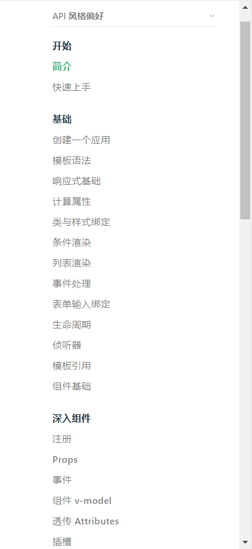
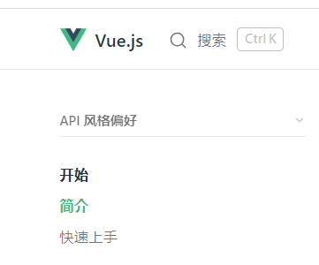
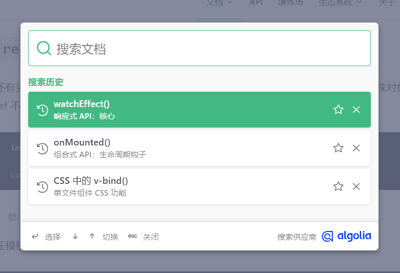

# 学习编程——文档学习法

## 方式

一般来说学习编程分为：

- 1.自学
- 2.从师受业

### 自学

- 1.自学的难度可定会大，时间多花费多，目标不明确等问题的出现
- 2.不看文档，而去观看不同机构不同老师的免费视频，每个老师都有自己的习惯，都有自己的特点，所以自学是一件困难的事

### 授业

- 2.有老师教学，学习效率会快，有老师的经验，能力提升会更快
- 3.遇到问题有老师帮助解答，效率更高

## 文档学习法

前面引入了学习方式：自学、授业

而如果要是学的更多更深，从师授业的方法显然不靠谱

所以学习编程，就有了一个新的自学方法——文档学习法

在这里我更加推荐自学，自学，自学!!!

### 了解文档结构

编程文档通常由多个部分组成，包括简介、安装说明、教程、参考手册等。在阅读文档之前，了解其结构是非常重要的。这样可以帮助你更快地找到所需的信息，并且可以避免浪费时间在不必要的内容上。

**掌握结构和目录就等于成功的一半**

了解了文档目录其实也是更好的穿线，复习查找资料的最好方法

### 阅读简介和概览

**了解这个框架（工具）的用途**

编程文档的简介和概览部分通常包含了项目的基本信息、主要特性、用途等方面的介绍。这些内容可以帮助你更好地了解所要使用的编程工具的背景和功能。在阅读简介和概览的过程中，你可以注意以下几点：

- 了解项目的定位和目标用户

- 确定项目的主要功能和用途

- 查看项目的版本信息和更新日志等

我们明白这个框架（工具）是干什么的，之后我们要进行思考，在开发中遇到什么样的问题，我们才能
使用这个框架（工具）

**只有阅读简介，才能明白其用途，更好了解运行方式，和底层逻辑**

### 查看示例代码

编程文档中通常包含了一些示例代码，这些代码可以帮助你更好地理解编程工具的使用方法和功能。通过查看示例代码，你可以学习如何正确地使用编程语言、库、框架等工具，并且可以从中学习一些最佳实践和技巧。
他也是可以很好的根据官方的代码的规则，规范我们的代码，让代码变得整洁。

**在做项目中，完全可以靠文档的复制粘贴来实现功能**

### 注意参数和返回值

在阅读函数、类、方法等代码段的文档时，你需要注意其参数和返回值的定义和说明。了解参数和返回值的含义和用法可以帮助你正确地使用编程工具，并且可以避免一些常见的错误和bug。
这样我们可以根据文档上面的的函数等方法的参数，返回值更好的实现想要的效果

**根据参数和返回值，可以基本了解用途，再根据源码，即可了解用法，以及对不妥之处修改**

### 搜索

如果你无法在编程文档中找到所需的信息，可以尝试使用搜索功能。许多编程文档都提供了搜索功能，你可以输入关键字进行搜索。使用搜索功能可以帮助你快速定位所需的信息，并且可以节省你的时间。

**搜索是文档网站必要模块之一，如果遇到问题或忘记知识点可以通过搜索来查找
或者可以根据文档总结自己的学习笔记，供自己学习**

### 例子

不爱看书的人对上面的内容可能不感兴趣，没有耐心看下去，看不懂

我现在给大家举个例子，文档学习的例子

#### 了解文档结构

首先以[vue](https://cn.vuejs.org/) 为例子

##### 首先观察导航栏


有文档，有api等等等等的内容，感兴趣的可以一个一个看

##### 然后在主要文档里面观察侧边栏


等等，往下翻还有内容

大致分为

- 开始
- 基础
- 深入组件
- 逻辑复用
- 内置组件
- 应用规模化
- 最佳实践
- TypeScript
- 进阶主题

就可以 根据这一个个目录从头到尾去学习了

#### 阅读简介和概览

阅读简介和概览我们可以在文档中打开`开始`


阅读简介里面的内容了解vue的用途和好处等

#### 查看示例代码

在每一个文档页面中都有例示代码，可以根据你的需求复制**更加相似的代码**，简单改一改就变成你的代码了

#### 注意参数和返回值

这就需要，看文档了

##### 以响应式基础为例

要了解ref(),和reactive()响应式变量的区别，里面传参的不同才能了解到具体用法

```txt
使用 reactive() API。与将内部值包装在特殊对象中的 ref 不同，reactive() 将使对象本身具有响应性
```

#### 搜索

根据想查找的内容搜索

## 总结

文档学习法适合所有开发者，一些老师也是根据官方文档来教学，这样更加的准确，也不会出现比较烂的代码的问题


 

